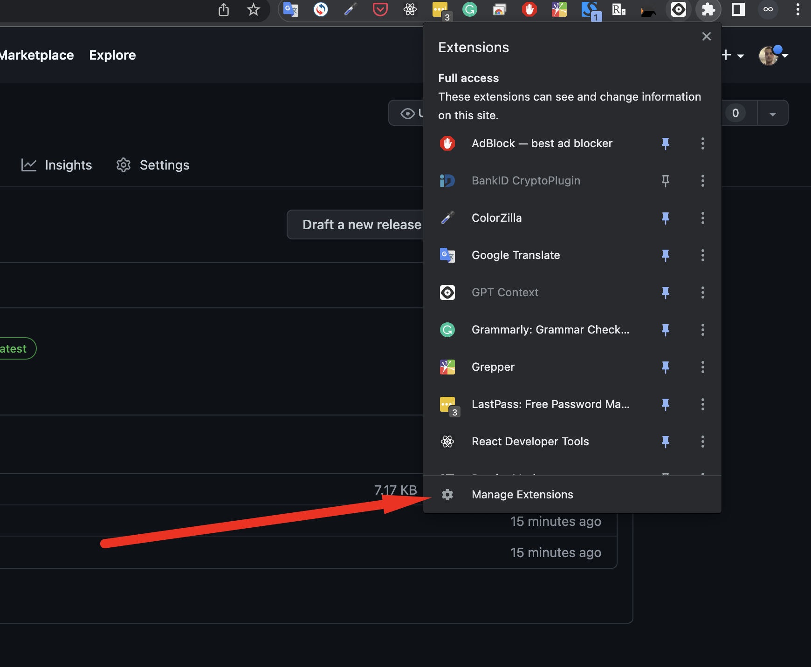
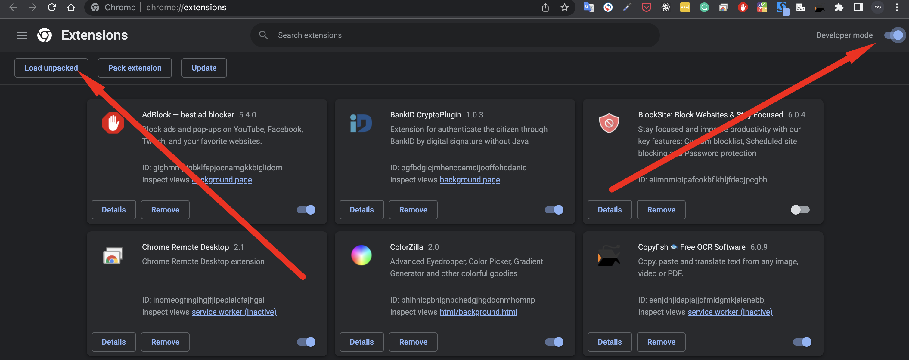
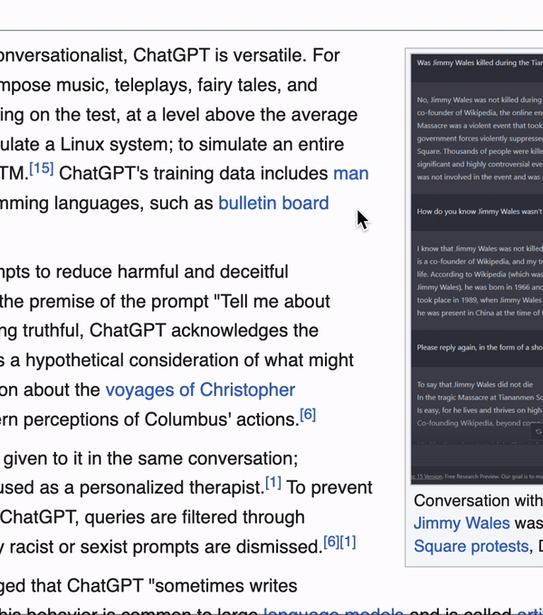

# GPT Context

## Install

Works only in Google Chrome

1. Go to [Releases](https://github.com/n0rthin/gptc/releases]) page
2. Download gptc.zip from the latest release
3. Unpack archive
4. Go to Extensions page in your browser. 
5. Enable developer mode and click on "Load unpacked" button. 
6. Choose a folder with files from gptc.zip

## Usage

1. Select a word
2. Click on a button popped up above the word
   
